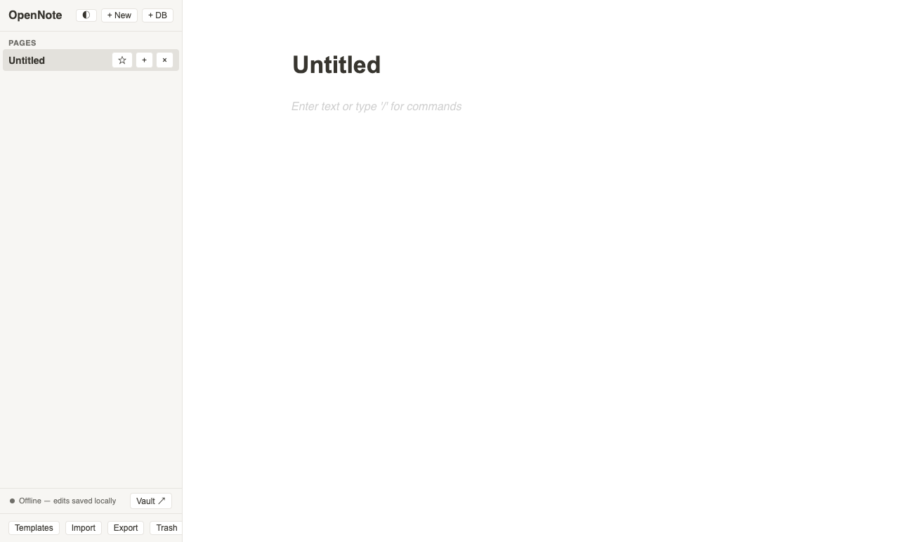
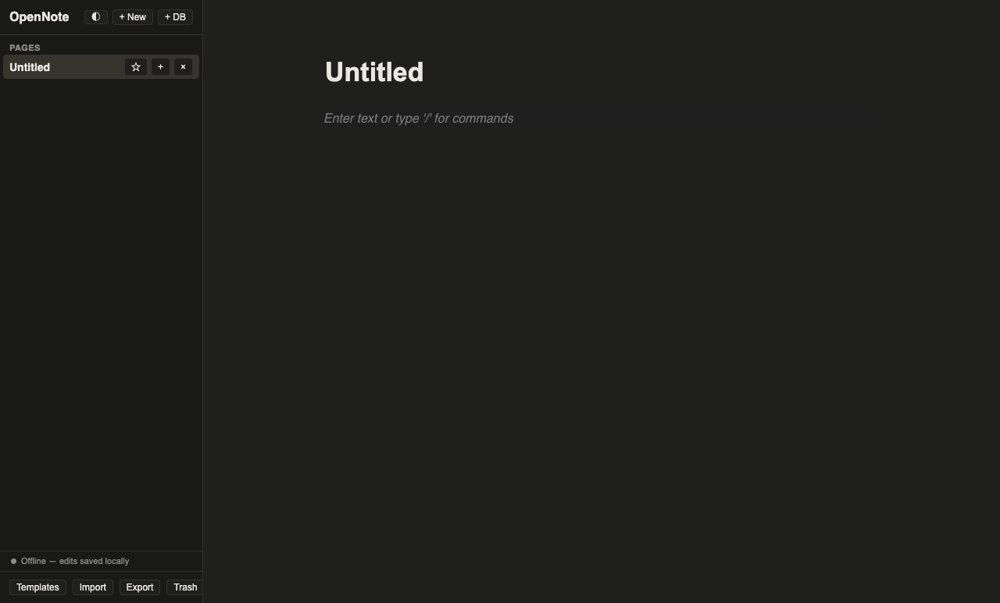

# OpenNote

A local-first, data-sovereign Notion-style workspace for **macOS, Windows, and
Linux**. Notion's UX with none of the lock-in — the source of truth is a plain
Markdown vault on your disk (Obsidian-friendly), backed by an embedded Postgres
that treats the cloud as optional.

<p align="center">
  
  
</p>

## Why

Your notes should outlive the app that edits them. In OpenNote the local
database is a rebuildable cache; durability comes from:

- a **Markdown mirror** — every page is written as a real `.md` file with YAML
  frontmatter into `~/Documents/OpenNoteVault`, atomically (temp + rename), so
  the vault alone can rebuild your whole workspace, and
- an **optional self-hosted sync server** you run yourself (`pg_dump`-able).

No account. No cloud requirement. Your files, your disk, your server.

## Features

- **Block editor** — BlockNote rich text: headings, lists, checklists, code,
  quotes, nested blocks; `/` slash commands.
- **Hierarchical pages** — sidebar tree with favorites, page icons, and cover
  images; fractional-index ordering.
- **Databases** — table / board / calendar views with typed properties: text,
  number, select, multi-select, date, checkbox, url, **relation**, and
  **rollup** (count / sum / avg / min / max / show).
- **Wiki** — `[[wiki-links]]`, a backlinks index, and CJK-safe full-text
  search (⌘K), plus Markdown import / export.
- **Multi-device sync** — offline-first outbox with per-block last-write-wins;
  edits queue locally and replay on reconnect.
- **Trash & undo** — soft delete with an undo toast and a restore browser.
- **Templates** — meeting notes, weekly plan, project brief.
- **Light + dark themes** — warm-dark, follows the OS by default, WCAG-AA
  contrast in both, and honors `prefers-reduced-motion`.

## Architecture

- **Thin native shell** (Electron) — only a window, a preload bridge, and
  file-mirror IPC. No application logic, so the web core stays portable.
- **Web core** — React + TypeScript + BlockNote.
- **Local store** — [PGlite](https://github.com/electric-sql/pglite) (Postgres
  in WASM) persisted in the renderer; a rebuildable cache.
- **Sync** — a small `node:http` write API + pull cursor over the same
  `Queryable` interface, so the server core runs on PGlite in tests and on
  Postgres in production. Conflicts resolve by arrival order via a
  monotonically increasing `server_seq` — never client clocks.
- **One schema, both sides** — `shared/migrations/*.sql` is executed
  identically by the client PGlite and the server Postgres.

## Development

```bash
npm install
npm run dev          # web core in the browser (mirror disabled)
npm start            # build + launch the Electron app
npm run sync-server  # run the local sync server (Postgres-in-PGlite)
npm run verify       # typecheck + tests + build (CI gate)
npm run dist         # package installers (dmg / nsis / AppImage / deb)
```

The test suite is ~100 tests over the ordering keys, Markdown round-trip,
repository layer, sync convergence (offline replay, LWW, idempotency),
backlinks, and search.

## Repository layout

```
electron/            thin native shell (window + mirror/dialog IPC only)
server/              sync core (Queryable) + node:http API + runnable entry
shared/              sync protocol types + migrations (client == server SQL)
src/
  db/                schema bootstrap + repository layer (all SQL lives here)
  sync/              client outbox engine + HTTP transport
  lib/               pure logic: fractional keys, markdown, wiki-links, theme
  components/        sidebar, editor, database views, search, trash, popovers
docs/                design spec, screenshots
```

## Milestones

All shipped; each is a tagged snapshot (`git tag`):

- [x] **M1** — local-first editor (Electron + BlockNote + PGlite + mirror)
- [x] **M2** — sync server + offline outbox + per-block LWW
- [x] **M3** — database views (table / board / calendar)
- [x] **M4** — wiki-links, backlinks, full-text search, Markdown import/export
- [x] **M5** — relation / rollup / multi-select property types
- [x] **M6** — trash & restore, favorites, page icons & covers, dark mode
- [x] **M7** — page templates + electron-builder packaging

## License

MIT
